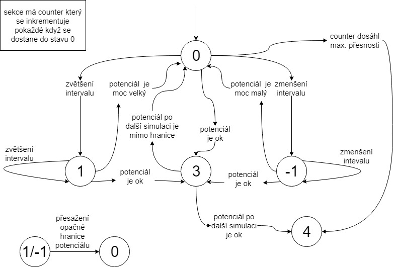

# Subway - Optimalizace jízdních řádů pomocí diskrétní simulace

## Zadání

Cílem programu *Subway* je na základě vstupních dat, které se skládají z linek dopravy, frekvence jednotlivých stanic, vzdálenosti mezi nimi, počtu cestujících apod., optimalizovat jízdní řád tak, aby byl potenciál dopravního prostředku ideálně využit.

## Výroba ideálního jízdního řádu - algoritmus

Celá doba provozu je v programu rozplánovaná do sekcí. Na začátku je pro každou linku pouze jedna sekce. Sekce jednotlivých linek jsou nezávislé. Každá sekce má uvnitř nastaveno v jakých intervalech se budou v dané sekci vypouštět vlaky na trať. Simulace pak probíhá popořadě podle všech sekcí. Každý vypuštěný vlak si zapamatuje v jaké sekci byl vypuštěn na trať a pak pravidelně aktualizuje potenciál dané sekce, avšak sekce si vždy zapamatuje maximum. Tudíž na začátku simulace každá sekce začíná s potenciálem = 0 a velkým intervalem a v průběhu simulace si zapamatuje maximální potenciál ze všech vlaků vypuštěných v dané sekci.

> potenciál = počet cestujících ve vlaku / kapacita vlaku, 	 potenciál ∈ <0,1>

Po doběhnutí simulace jednoho dne se projdou všechny sekce a zkontroluje se, zda-li jsou potenciály sekcí v mezích daných uživatelem.  Podle toho zda je nebo není potenciál v rámci mezí se upraví interval vlaků v dané sekci a spustí se další simulace. Každý stav má svůj vnitřní stav, který odpovídá stavu ve stavovém automatu (obr. 1), který znázorňuje úpravu intervalů.

